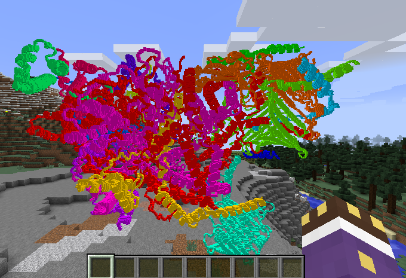
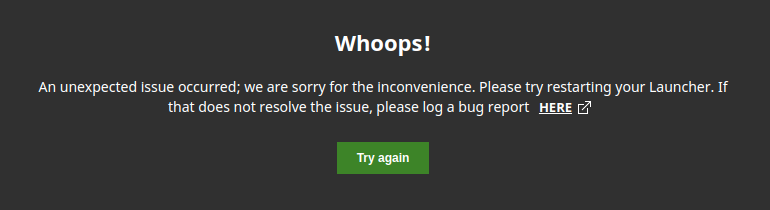

# Minecraft Protein Structure import <br> (Dresden Science Night 2025)
This repository outlines the process of importing protein pdb structures into Minecraft




### Requirements
For now we need a paid Minecraft / Mojang account.

### Installing Minecraft and required Mods
#### Minecraft
On Arch-Linux there are a few problems with running the yay repo version of the minecraft-launcher.
Therefore, we are using flatpak, which isolates the needed dependencies and gives us a easy to use installer.
```bash
flatpak install flathub com.mojang.Minecraft
flatpak run com.mojang.Minecraft
```
This will install minecraft to this directory: `~/.var/app/com.mojang.Minecraft/.minecraft/`

Now start the minecraft-launcher and see that everything has worked (this step is mandatory).
You will also be prompted to login with your minecraft account.

#### Forge
This is a very common mod-loader for minecraft and can be easily installed using its java installer.
If the installer does not find the minecraft installation automatically,
you'll need to pass the path to _.minecraft_ (see above) manually. <br>
We are running on Minecraft version 1.12.2. Download the corresponding Forge installer: <br>
https://files.minecraftforge.net/net/minecraftforge/forge/index_1.12.2.html <br>
(or use the .jar provided in the [forge](forge) directory)


Now start the minecraft-launcher once until you are in the main menu of the game.
Make sure to select the correct minecraft installation (Forge...) before pressing _Play_ in the launcher

#### Mods
There are multiple mods you'll need to download and install now. Just download all of them into `.minecraft/mods`
https://www.curseforge.com/minecraft/mc-mods/creativecore <br>
https://www.curseforge.com/minecraft/mc-mods/littletiles <br>
https://www.curseforge.com/minecraft/mc-mods/littletiles-3d-importer-exporter <br>
(I also added a copy of the mod files in the [mods](mods) directory)

Make sure you are downloading the mod for the correct Minecraft version (1.12.2)

Now you should be able to relaunch the game and use the mods!


### Importing Models
The mod supports .obj and .mtl files (even .jpg textures). Because of the way we installed Minecraft,
these files need to be stored inside the _.minecraft_ folder.

The GitHub page of the mod describes how importing models works in-game: <br>
https://github.com/Timardo/LT-3D-Importer-Exporter/wiki

## Creating Protein Models
### Setting up Conda
We programmatically create .obj and .mtl files from .pdb files in the [pdb_2_obj.py](pdb_2_obj.py) python script.
For this we first need to setup the conda environment the script runs in:

Creating Conda environment
```bash
conda create --prefix ./pymol_env
```
Updating environment (only use once after changing dependencies in [environment.yml](environment.yml))
```bash
conda env update --prefix ./pymol_env
```

### Running the script
For now all our script does is to load all .pdb files from the [proteins](proteins) directory and converting them to
.obj and .mtl files, coloring each chain of our protein in a different color. <br>
For our purposes, .obj files store the geometry of our proteins and where each color should be applied,
while the .mtl files store color information.
```bash
conda run --prefix ./pymol_env python pdb_2_obj.py
```
We can also do this process manually in pymol (just without the .mtl file, see https://pymolwiki.org/index.php/Save). <br>
Starting PyMol:
```bash
conda run --prefix ./pymol_env python -m pymol
```


## Bugs & Fixes
### Minecraft Launcher crashes on startup on Arch-Linux

+ fix: close the window, then go to _.minecraft_ folder and delete _webcache2_ directory
+ restart the launcher
+ really annyoing, has to be done after every restart for me

### BlockPrintr doesn't show some models
+ this occurs because of cashing issues in the mod (I think...)
+ fix: delete all folders used by BlockPrintr except the _input_ folder. They can be found in your _.minecraft/config/blockprintr_